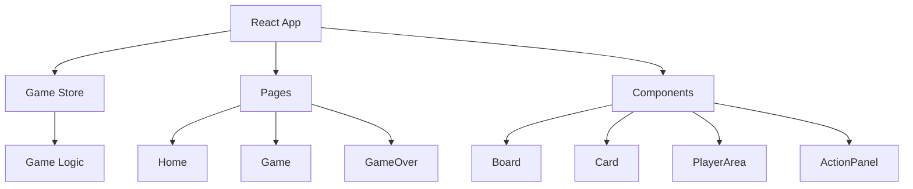
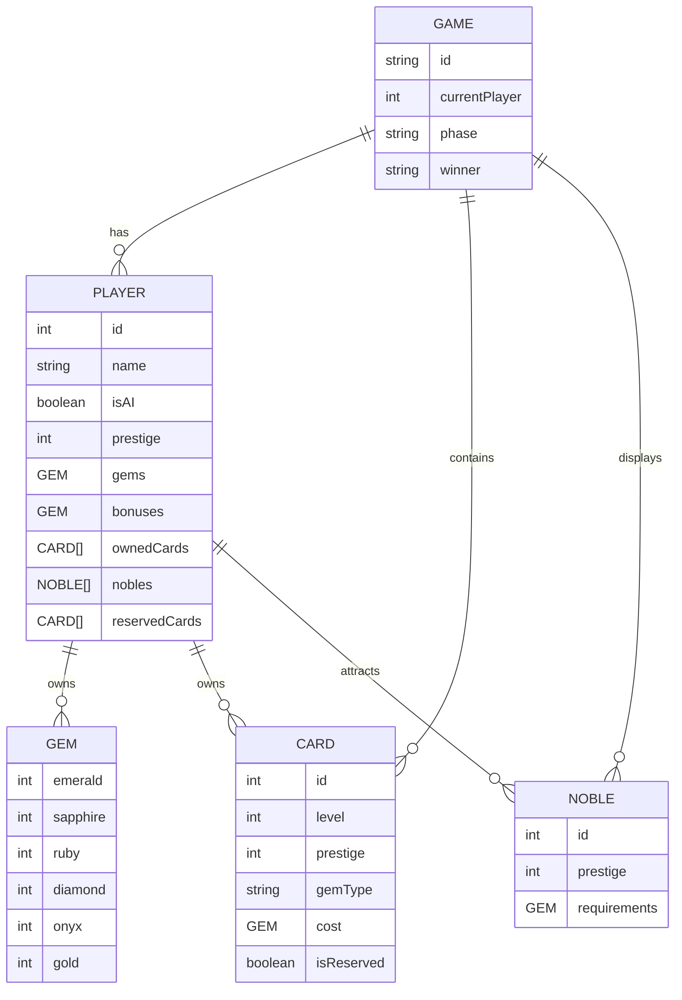

## 1. Architecture Design
本项目采用纯前端架构，使用 React + TypeScript + TailwindCSS 构建，游戏状态完全在客户端管理，无需后端服务。

## 2. Technology Description
- Frontend: React@18 + TypeScript + TailwindCSS + Vite
- State Management: Zustand
- Initialization Tool: vite-init
- Backend: None
- Database: None

## 3. Route Definitions
| Route | Purpose |
|-------|---------|
| / | 首页 - 模式选择 |
| /game | 游戏页面 - 核心游戏界面 |
| /gameover | 游戏结束页面 - 结果展示 |

## 4. API Definitions (if backend exists)
无需后端 API

## 5. Server Architecture Diagram (if backend exists)
无需后端服务

## 6. Data Model
### 6.1 Data Model Definition

### 6.2 Data Definition Language
无需数据库
