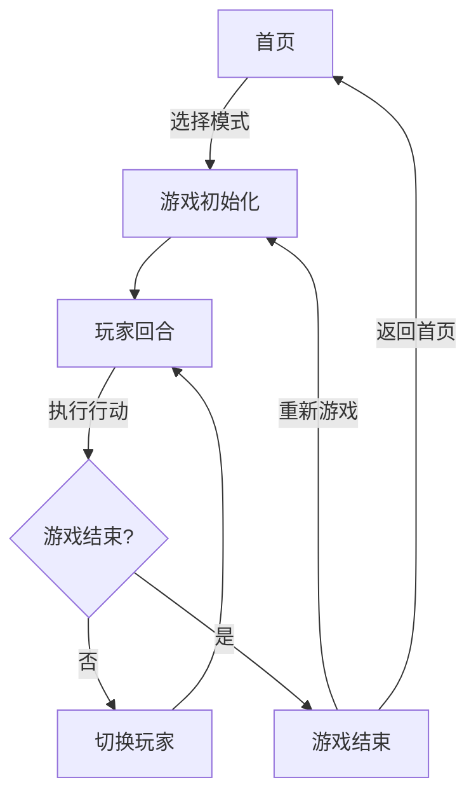

## 1. Product Overview
璀璨宝石线上版是一款复刻经典桌面游戏的移动端网页游戏，支持人机对战和真人对战模式，让玩家随时随地体验策略博弈的乐趣。
- 目标用户：桌面游戏爱好者、策略游戏玩家，10岁以上
- 市场价值：填补移动端高品质璀璨宝石复刻的空白，提供流畅的游戏体验

## 2. Core Features

### 2.1 User Roles
| Role | Registration Method | Core Permissions |
|------|---------------------|------------------|
| Player | 无需注册 | 进行游戏、选择模式、查看游戏历史 |

### 2.2 Feature Module
1. **首页**：游戏标题、模式选择（人机/真人）、规则说明
2. **游戏页面**：游戏棋盘、玩家资源展示、卡牌操作区、行动选择
3. **游戏结束页面**：结果展示、重新游戏、返回首页

### 2.3 Page Details
| Page Name | Module Name | Feature description |
|-----------|-------------|---------------------|
| 首页 | Hero 区域 | 游戏标题展示、视觉焦点动画 |
| 首页 | 模式选择 | 人机对战、真人对战按钮 |
| 首页 | 规则说明 | 展开/收起的游戏规则介绍 |
| 游戏页面 | 棋盘区域 | 显示发展卡牌、贵族牌、宝石堆 |
| 游戏页面 | 玩家区域 | 显示当前玩家的宝石、卡牌、分数 |
| 游戏页面 | 操作区域 | 拿取宝石、保留卡牌、购买卡牌等操作按钮 |
| 游戏结束页面 | 结果展示 | 显示获胜者、最终分数、游戏时长 |
| 游戏结束页面 | 操作按钮 | 重新游戏、返回首页 |

## 3. Core Process
用户进入首页选择游戏模式，系统初始化游戏，玩家轮流进行操作，直到有玩家达到15威望分，游戏结束显示结果。

## 4. User Interface Design
### 4.1 Design Style
- 主色调：深紫色（#5D12D2）、金色（#FFD700）
- 按钮风格：圆角矩形、渐变背景、点击反馈
- 字体：Playfair Display（标题）、Noto Sans SC（正文）
- 布局风格：卡片式布局、层次分明
- 图标风格：宝石主题、精美装饰

### 4.2 Page Design Overview
| Page Name | Module Name | UI Elements |
|-----------|-------------|-------------|
| 首页 | Hero 区域 | 宝石图标动画、渐变背景、发光效果 |
| 首页 | 模式选择 | 卡片按钮、悬停放大、点击涟漪 |
| 游戏页面 | 棋盘区域 | 分层布局、卡牌阴影、贵族牌金色边框 |
| 游戏页面 | 玩家区域 | 圆形宝石指示器、分数醒目显示 |
| 游戏页面 | 操作区域 | 底部悬浮、半透明背景、大按钮 |

### 4.3 Responsiveness
- 移动端优先设计，适配 320px-768px 屏幕
- 触摸优化：按钮尺寸 ≥48px，间距合理
- 横屏/竖屏适配

### 4.4 3D Scene Guidance
- 不适用3D场景
